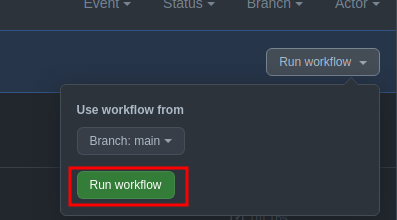

<h1 align="center">
  
</h1>
<p align="center"><strong>DevOps Test</strong></p>
<p align="center">
  <a href="https://opensource.org/licenses/MIT">
    
  </a>
</p>

Uma simples aplicação que retorna em qual URL o usuario se encontra.

<hr>

## **Execução**

Para executarmos o projeto com sucesso devemos ter em mente que existem duas formas aqui de fazer isso, uma utilizando a plataforma do Github Actions para fazer o CI/CD tanto do build quanto da infraestrutura na **aws** e outra que segue o contexto mais local, que é a execução do arquivo **Makefile** na raiz do projeto, ambos irão executar o deploy da imagem docker no Dockerhub e também a execução dos arquivos de IaC do terraform para disponibilizar a infra.


### **Fluxo de CI/CD**

O workflow do CI/CD da aplicação se encontra na pasta `.github/workflows/` para executarmos com sucesso esse fluxo devemos ter atenção em alguns pontos que são as secrets que utilizamos para nao ter informações sensiveis no nosso codigo fonte.

1. `DOCKER_USER`
2. `DOCKER_PASSWORD`
3. `AWS_SECRET_ACCESS_KEY`
4. `AWS_ACCESS_KEY_ID`

Por padrão estou utilizando a **aws_region** `us-east-2` e para armazenar as imagens Docker da aplicação, estou utilizando-se do repositório público do **Dockerhub**, caso não tenha uma conta pode encontrar as informações para fazer uma [aqui](https://hub.docker.com/).

No meu caso a imagem docker irá ser publicada com a tag do meu usuário, exemplo: `thiago18l/go_web_server:commit`

O `commit` nada mais é que o hash da última alteração feita no código fonte, proporcionando uma opção de rollback em casos de ambientes Kubernetes e etc.

A execução do deployment via Github actions é feita de modo automatico. 

Caso queira rodar o workflow é só utilizar a opção:




Assim irá executar a etapa de CI mesmo sem haver um push no repositório.

## **Execução de forma local**

Para ambientes locais, contido no repositório existe um arquivo chamado `Makefile`, para executar os comandos contidos nesse arquivo você precisará do pacote `make` instalado em sua máquina.

Variáveis de ambientes necessárias para executar com sucesso:

precisaremos criar um arquivo chamado `deploy.env` na raiz do projeto com as seguintes informações:

```sh deploy.env
  # deploy.env

  APP_NAME=go_web_server # Nome da aplicação
  USER= # Usuário do Dockerhub onde irá ser enviada a imagem docker.
  AWS_ACCESS_KEY_ID= # AWS Access key id do seu usuário IAM
  AWS_SECRET_ACCESS_KEY= # Credencial secreta do usuário IAM
```

Caso tenha dúvida em como pegar essas informações vindas da AWS segue o link com mais informações: [Amazon Web Services](https://aws.amazon.com/blogs/security/wheres-my-secret-access-key/).

Para essa aplicação teste, utilizei um usuário IAM com permissões de **Administrador**, o que recomendo também para quem for utilizar essa aplicação de teste.


#### **Comandos disponíveis**:

- **build**: Comando responsável pela build da imagem Docker

- **build-nc**: Comando responsável pela build da imagem com a opção --no-cache

- **run**: Comando responsável pela execução local da imagem Docker (*app ficará disponível na porta 8080*)

- **up**: Comando responsável pela build da imagem e pela a execução da mesma. (mais indicado a ser usado)

- **stop**: Comando responsável por parar a aplicação

- **tag_with_version**: Comando responsável pela tag da imagem docker com uma versão especifíca contida no arquivo `Gopkg.toml`

- **tag_with_commit**: Comando responsável pela tag da imagem docker com o último commit feito no código fonte

- **publish_with_version**: Comando responsável pela publicação da imagem no DockerHub com a versão encontrada no arquivo `Gopkg.toml`

- **publish_with_commit**: Comando responsável pela publicação da imagem no DockerHub com o último commit feito no código fonte

- **curl**: Comando responsável pela requisição na porta 8080 do `localhost`

- **version**: Mostra a última versão encontrada no arquivo `Gopkg.toml`

- **commit**: Mostra o último commit realizado no código fonte

#### Infraestrutura AWS

- **init**: Comando responsável por inicializar os arquivos terraform. Para mais detalhes: [terraform init](https://www.terraform.io/cli/commands/init)

- **plan**: Comando responsável por cria um plano de execução. Para mais detalhes [terraform plan](https://www.terraform.io/cli/commands/plan)

- **exec**: Comando responsável por executar o comando `apply` do terraform que cria nossa infra. Para mais detalhes [terraform apply](https://www.terraform.io/cli/commands/apply) 

*obs: no Makefile o comando está com a flag `-auto-approve` que irá executar o comando sem requisitar confirmação*

- **destroy**: Comando responsável por desfazer toda a nossa infraestrutura gerada pelo o comando `apply`.


<hr>

<p align="center">
<strong>Made by <a href="https://github.com/thiago18l">Thiago Lopes</a></strong>
</p>